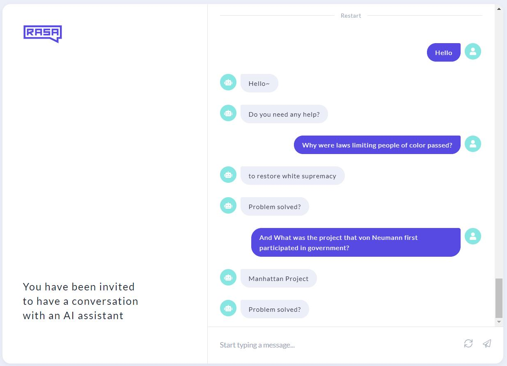

<h1 align="center">rasa-faq-bot</h1>
<p align="center">Using Rasa to build a FAQ bot</p>

<p align="center">
  <a href="https://github.com/nghuyong/rasa-faq-bot/stargazers">
    
  </a>
  <a href="https://github.com/nghuyong/rasa-faq-bot/issues">
        
  </a>
  <a href="https://github.com/nghuyong/rasa-faq-bot/">
        
  </a>
  <a href="https://github.com/nghuyong/rasa-faq-bot/blob/master/LICENSE">
        
  </a>
</p>

<h2 align="center">介绍</h2>

**[Rasa](https://rasa.com/)**是一个功能强大的对话框架，我们可以轻松地使用它构建一个实用的对话系统。
FAQ（常见问题）bot是智能客户服务产品中最重要的部分，它可以帮助用户解决一般问题。我们一般从实际场景中收集常见问题和答案，这些标准问答对我们称之为知识库。FAQ-bot将根据此知识库智能地回答用户问题。

因此，在这个项目中，我们将使用Rasa构建智能faq-bot！


<h2 align="center">快速上手</h2>

**1. 预处理**

* 根据data/nlu/faq.json中的数据格式，用自己的数据将其替换
* 运行process.py脚本（默认将数据条数最多设置成1000，可自行修改process.py）
* 运行actions.py


**2. 运行脚本启动bert-service服务**

项目中data/nlu/faq.json存放着知识库，里面包含着许多问题和对应的解答。我们使用bert-service去对被询问的问题和知识库中的问题进行相似度计算，然后在知识库中匹配相似度最高的问题，并将相应的答案作为faq-bot返回给用户的解答。

* 具体操作：
	* 安装bert-serving-server和bert-serving-client，详情请查看[bert-as-service](https://github.com/hanxiao/bert-as-service)项目。
	* 下载预训练BERT模型，将模型的压缩文件（比如chinese_L-12_H-768_A-12.zip）解压。
	* 将脚本 `run_bert_service.sh` 中的 `BERT_CHINESE_MODEL_DIR` 修改成模型的路径
	```latex
     -bert-serving-start \
     -pooling_layer -4 -3 -2 -1 \
     -model_dir=BERT_CHINESE_MODLE_DIR \
     -num_worker=8 \
     -max_seq_len=16
    ```
	* 运行bert-service脚本
	```bash 
	./run_bert_service.sh
	```


**3. 运行rasa客户服务**

我们在action.py中编写自己的客户服务，即对话框接收到客户的信息时，如何回应用户。在该项目中自然就是检测用户的意图是不是faq，如果是，那么就到知识库中寻找最匹配的问题，并给予用户解答；如果没有匹配到合适的问题，同样也要告诉用户“这个问题在我能力之外了”。

* 修改endpoints.yml中的端口，使之与actions的端口保持一致：

```latex
action_endpoint:
  url: "http://localhost:5055/webhook"
```

* 启动服务：

```bash
rasa run actions
```

然后不出意外就可以看到这样的输出显示：

```latex
│2019-08-09 11:10:32 INFO     rasa_sdk.endpoint  - Starting action endpoint server...
│(1000, 3072)
│2019-08-09 11:10:33 INFO     rasa_sdk.executor  - Registered function for 'action_get_answer'.
│2019-08-09 11:10:33 INFO     rasa_sdk.endpoint  - Action endpoint is up and running. on ('0.0.0.0', 5055)
```


**4. 启动Rasa X**

Rasa X是一个很好用的rasa工具，可以从真实对话中学习并改进对话模型。需要注意的是，特定的Rasa版本需要特定版本的Rasa X去配套使用，否则会出问题。

* 安装[Rasa X](https://rasa.com/docs/rasa-x/installation-and-setup/)

* 本地运行Rasa X
	* 
```bash
rasa x
```
* 服务器端运行Rasa X

一般需要修改端口，使之成服务器网络可以访问的端口（以8888端口为例）

```bash
rasa x --rasa-x-port 8888
```


不出意外的话就可以看到这样的输出：

```latex
Starting Rasa X in local mode... �🚀                                                                                               
 
The server is running at http://localhost:8888/login?username=me&password=zrjV0BwYSzYP
```

* 如果是在服务器端，那么把localhost改成服务器的ip地址再去访问就可以看到对话的界面了


<h2 align="center">对话界面</h2>




**5. 注意事项**

* 有时候启动服务的时候会显示端口占用，这个时候直接kill掉相关端口的进程就好了
* 显示数据库锁住了之类的报错的话，就把项目里的rasa.db和tracker.db两个文件删掉就好了
* 一定要配套使用rasa和rasa x，不然会出问题，本项目使用的是最新的rasa 1.2.2和rasa x 0.20.1
